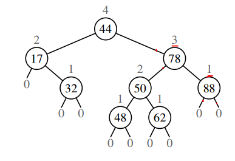
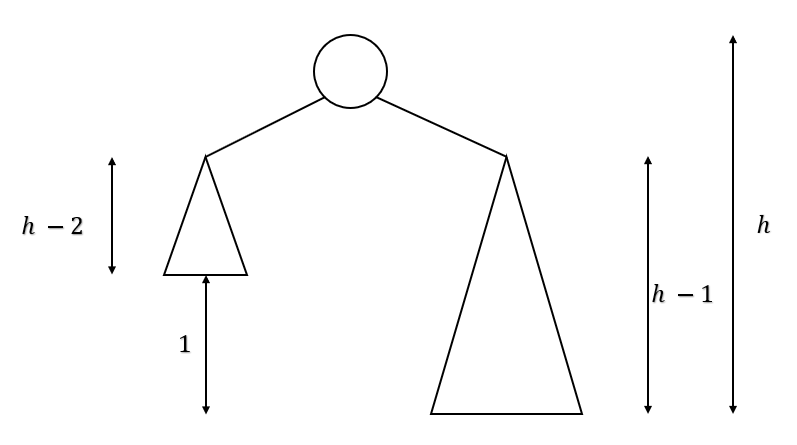
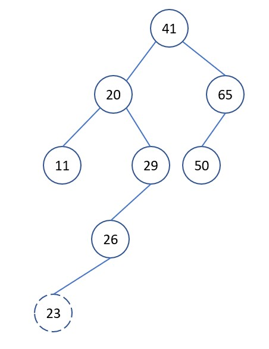
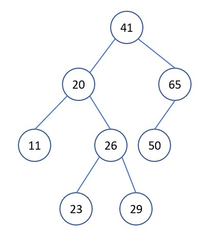
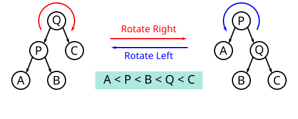
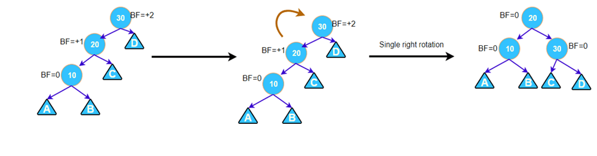
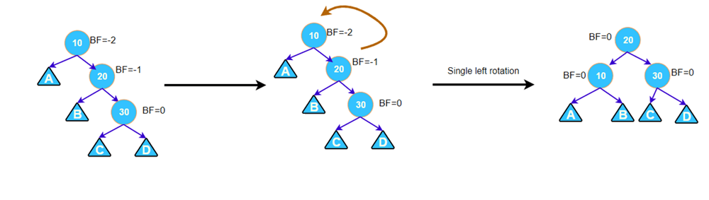
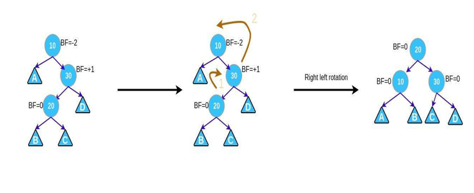

# Cây AVL, thuật toán sắp xếp AVL

<head>
<link rel="preconnect" href="https://fonts.gstatic.com">
<link href="https://fonts.googleapis.com/css2?family=Cinzel:wght@600&display=swap" rel="stylesheet">
</head>
<div style="display: flex; align-items: center;">

<span style="margin-left: 15px; color: #b71c1c;font-family: 'Cinzel', serif;">Tran Lam</span> <span style="margin-left: 15px;font-family: 'Cinzel', serif;">Feb 22,2021</span> <span style="margin-left: 15px;font-family: 'Cinzel', serif;" >9 min read</span>
</div>
<br/>

Ở bài viết trước, mình đã nói về cây tìm kiếm nhị phân, nếu bạn đọc chưa xem qua, có thể tìm thấy [tại đây](https://lam1051999.github.io/md_blogs/blogs/binarysearch_tree.html). Với sự hiệu quả trong các hoạt động tìm kiếm, chèn, xóa,... cây tìm kiếm nhị phân có thể thực hiện được trong logrithmic time (\\(\Theta(logn)\\)) ở average case. Bài viết này, mình sẽ nói về cây AVL, là 1 loại của cây tìm kiếm nhị phân, đảm bảo rằng trong tất cả các case, time complexity của các hoạt động trên đều là \\(\Theta(logn)\\). 

### Các đề mục

[1. Cây AVL](#1-cây-avl)

[2. Đánh giá chiều cao của cây](#2-Đánh-giá-chiều-cao-của-cây)

&nbsp;&nbsp;&nbsp;&nbsp;&nbsp;[2.1. Cách 1](#21-cách-1)

&nbsp;&nbsp;&nbsp;&nbsp;&nbsp;[2.2. Cách 2](#22-cách-2)

[3. Các hoạt động trên cây AVL](#3-các-hoạt-động-trên-cây-avl)

&nbsp;&nbsp;&nbsp;&nbsp;&nbsp;[3.1. Chèn node (insert), xóa node (delete), tìm node (search)](#31-chèn-node-insert-xóa-node-delete-tìm-node-search)

&nbsp;&nbsp;&nbsp;&nbsp;&nbsp;[3.2. Các hoạt động cân bằng cây](#32-các-hoạt-động-cân-bằng-cây)

&nbsp;&nbsp;&nbsp;&nbsp;&nbsp;&nbsp;&nbsp;&nbsp;&nbsp;&nbsp;[3.2.1. Balance factor](#321-balance-factor)

&nbsp;&nbsp;&nbsp;&nbsp;&nbsp;&nbsp;&nbsp;&nbsp;&nbsp;&nbsp;[3.2.2. Các hoạt động cân bằng cây](#322-các-hoạt-động-cân-bằng-cây)

&nbsp;&nbsp;&nbsp;&nbsp;&nbsp;[3.3. Cân bằng cây trong trường hợp cụ thể](#33-cân-bằng-cây-trong-trường-hợp-cụ-thể)

&nbsp;&nbsp;&nbsp;&nbsp;&nbsp;&nbsp;&nbsp;&nbsp;&nbsp;&nbsp;[3.3.1. Trường hợp cây con trái có trọng về bên trái (left left case)](#331-trường-hợp-cây-con-trái-có-trọng-về-bên-trái-left-left-case)

&nbsp;&nbsp;&nbsp;&nbsp;&nbsp;&nbsp;&nbsp;&nbsp;&nbsp;&nbsp;[3.3.2. Trường hợp cây con trái có trọng về bên phải (left right case)](#332-trường-hợp-cây-con-trái-có-trọng-về-bên-phải-left-right-case)

&nbsp;&nbsp;&nbsp;&nbsp;&nbsp;&nbsp;&nbsp;&nbsp;&nbsp;&nbsp;[3.3.3. Trường hợp cây con phải có trọng về bên phải (right right case)](#333-trường-hợp-cây-con-phải-có-trọng-về-bên-phải-right-right-case)

&nbsp;&nbsp;&nbsp;&nbsp;&nbsp;&nbsp;&nbsp;&nbsp;&nbsp;&nbsp;[3.3.4. Trường hợp cây con phải có trọng về bên trái (right left case)](#334-trường-hợp-cây-con-phải-có-trọng-về-bên-trái-right-left-case)

[4. Code python cho các hoạt động trên cây AVL](#4-code-python-cho-các-hoạt-động-trên-cây-avl)

[5. Thuật toán sắp xếp AVL](#5-thuật-toán-sắp-xếp-avl)

[6. Mở rộng](#6-mở-rộng)

[7. Tài liệu tham khảo](#7-tài-liệu-tham-khảo)

### 1. Cây AVL
Cây AVL là một cây tìm kiếm nhị phân cân bằng, trong đó chiều cao của cây con trái và cây con phải hơn kém nhau nhiều nhất 1 \\((1)\\). Trong qua trình thực hiện các hoạt động trên cây khiến cây không cân bằng, ta cần thực hiện cân bằng lại cây để đảm bảo tính chất \\((1)\\).

<div style="text-align:center;">

</div>

### 2. Đánh giá chiều cao của cây
Chiều cao của cây

<div style="text-align:center;">

\\(h\\) = max{ chiều cao cây con trái, chiều cao cây con phải } + 1.

</div>

Chiều cao của các node được đánh số như hình ở bên trên.

Với tính chất \\((1)\\), worst case của cây AVL xảy ra khi cây con phải có chiều cao lớn hơn cây con trái 1 đơn vị cho tất cả các node (hoặc ngược lại).

Gọi \\(N{_h}\\) là số node nhỏ nhất trong cây có chiều cao là \\(h\\).

<div style="text-align:center;">

</div>

Với đồ hình như trên, ta có
<div style="text-align:center;">

\\(N{_ {O(1)}} = O(1)\\) và \\(N{_ h} = 1 + N{_ {h-1}} + N{_{h-2}}\\)

</div>

#### 2.1. Cách 1

Biểu thức trên khiến ta liên tưởng đến dãy fibonacci, ta có \\(N{_h} > F{_h}\\) với \\(F{_h}\\) là số fibonacci thứ \\(h\\). Ta có \\(F{_h} = \frac{\gamma^h}{\sqrt{5}}\\), với \\(\gamma = 1.61803398875...\\), (golden ratio).

Với \\(N{_h} = n\\) (số node trong cây).

<div style="text-align:center;">

\\( n > \frac{\gamma^h}{\sqrt{5}} => h < log{_\gamma}n => h < 1.440log{_2}n \\).

</div>

#### 2.2. Cách 2

<div style="text-align:center;">

\\(=> N{_ h} = 1 + N{_ {h-1}} + N{_{h-2}}\\)

\\(=> N{_ h} > 1 + 2N{_{h-2}}\\)

\\(=> N{_ h} > 2N{_{h-2}}\\)

\\(=> h < 2log{_2}n\\)

</div>

Do vậy, \\(h = O(logn)\\).

### 3. Các hoạt động trên cây AVL

#### 3.1. Chèn node (insert), xóa node (delete), tìm node (search)
Các hoạt động kể trên trong cây AVL cũng giống như trong cây tìm kiếm nhị phân, với \\(h = O(logn)\\). Điểm khác biệt trong chèn và xóa node là sau khi thực hiện các hoạt động đó, ta cần làm thêm một bước cân bằng cây để đảm bảo tính chất \\((1)\\).

#### 3.2. Các hoạt động cân bằng cây
Ví dụ sau đây sẽ thể hiện sự cần thiết trong việc cân bằng lại cây

Giả sử ta có cây sau

<div style="text-align:center;">

</div>

Ta muốn chèn 23 vào cây, thực hiện chèn như trong cây tìm kiếm nhị phân. Sau khi chèn, ta thấy tính chất \\((1)\\) bị vi phạm. Ta cần cân bằng lại cây để có được

<div style="text-align:center;">

</div>

##### 3.2.1. Balance factor
Trong cây nhị phân, balance factor được định nghĩa như sau

<div style="text-align:center;">

\\(BF(x)\\) = chiều cao cây con trái của \\(x\\) \\(-\\) chiều cao cây con phải của \\(x\\).

</div>

Như vậy, trong cây AVL, ta có \\(BF(x) \in \\{-1, 0, 1\\} \\).

##### 3.2.2. Các hoạt động cân bằng cây

Khi BF của một node nào đó có giá trị không nằm trong tập giá trị trên, khi đó ta cần thực hiện cần bằng lại cây.
Ta có 2 loại hoạt động cân bằng cơ bản của cây AVL: **right rotation** và **left rotation**

<div style="text-align:center;">

</div>


#### 3.3. Cân bằng cây trong trường hợp cụ thể

##### 3.3.1. Trường hợp cây con trái có trọng về bên trái (left left case)
Trường hợp này xảy ra khi một node có BF = 2 và cây con trái của nó có BF = 1. Khi đó, ta chỉ cần 1 lần **right rotation** tại vị trí node cần xét thì cây cân bằng.

<div style="text-align:center;">

</div>

##### 3.3.2. Trường hợp cây con trái có trọng về bên phải (left right case)
Trường hợp này xảy ra khi một node có BF = 2 và cây con trái của nó có BF = -1. Khi đó, ta cần làm lần lượt 2 bước sau
* **Left rotation** cây con trái.
* **Right rotation** node cần xét.

<div style="text-align:center;">

</div>

##### 3.3.3. Trường hợp cây con phải có trọng về bên phải (right right case)
Trường hợp này xảy ra khi một node có BF = -2 và cây con phải của nó có BF = -1. Khi đó, ta chỉ cần 1 lần **left rotation** tại vị trí node cần xét thì cây cân bằng.

<div style="text-align:center;">

</div>

##### 3.3.4. Trường hợp cây con phải có trọng về bên trái (right left case)
Trường hợp này xảy ra khi một node có BF = -2 và cây con trái của nó có BF = 1. Khi đó, ta cần làm lần lượt 2 bước sau
* **Right rotation** cây con phải.
* **Left rotation** node cần xét.

<div style="text-align:center;">

</div>

### 4. Code python cho các hoạt động trên cây AVL

```python
# ---------------------------METHOD TO HELP BALANCE THE TREE---------------------------
#      y                               x
#     / \     Right Rotation          /  \
#    x   T3   - - - - - - - >        T1   y
#   / \       < - - - - - - -            / \
#  T1  T2     Left Rotation            T2  T3

# ---------------------------BALANCE THE TREE IN PARTICULAR CASES---------------------------
# -----Left Left Case
#          z                                      y
#         / \                                   /   \
#        y   T4      Right Rotate (z)          x      z
#       / \          - - - - - - - - ->      /  \    /  \
#      x   T3                               T1  T2  T3  T4
#     / \
#   T1   T2
# -----Left Right Case
#      z                               z                           x
#     / \                            /   \                        /  \
#    y   T4  Left Rotate (y)        x    T4  Right Rotate(z)    y      z
#   / \      - - - - - - - - ->    /  \      - - - - - - - ->  / \    / \
# T1   x                          y    T3                    T1  T2 T3  T4
#     / \                        / \
#   T2   T3                    T1   T2
# -----Right Right Case
#   z                                y
#  /  \                            /   \
# T1   y     Left Rotate(z)       z      x
#     /  \   - - - - - - - ->    / \    / \
#    T2   x                     T1  T2 T3  T4
#        / \
#      T3  T4
# -----Right Left Case
#    z                            z                            x
#   / \                          / \                          /  \
# T1   y   Right Rotate (y)    T1   x      Left Rotate(z)   z      y
#     / \  - - - - - - - - ->     /  \   - - - - - - - ->  / \    / \
#    x   T4                      T2   y                  T1  T2  T3  T4
#   / \                              /  \
# T2   T3                           T3   T4

class AVLNode:
    def __init__(self, val):
        self.left = None
        self.right = None
        self.val = val
        self.height = 1


class AVLTree:
    def insert(self, root, key):
        # perform bst
        if not root:
            return AVLNode(key)
        if root.val < key:
            root.right = self.insert(root.right, key)
        if root.val > key:
            root.left = self.insert(root.left, key)
        # update the height of the ancestor node
        root.height = 1 + max(self.get_height(root.left),
                              self.get_height(root.right))

        # get balance factor
        balance = self.get_balance(root)

        # perform balance
        # left left
        if balance > 1 and key < root.left.val:
            return self.right_rotate(root)
        # right right
        if balance < -1 and key > root.right.val:
            return self.left_rotate(root)
        # left right
        if balance > 1 and key > root.left.val:
            root.left = self.left_rotate(root.left)
            return self.right_rotate(root)
        # right left
        if balance < -1 and key < root.left.val:
            root.right = self.right_rotate(root.right)
            return self.left_rotate(root)

        return root

    def left_rotate(self, x):
        y = x.right
        T2 = y.left

        y.left = x
        x.right = T2

        x.height = 1 + max(self.get_height(x.left), self.get_height(x.right))
        y.height = 1 + max(self.get_height(y.left), self.get_height(y.right))

        return y

    def right_rotate(self, y):
        x = y.left
        T2 = x.right

        x.right = y
        y.left = T2

        x.height = 1 + max(self.get_height(x.left), self.get_height(x.right))
        y.height = 1 + max(self.get_height(y.left), self.get_height(y.right))

        return x

    def get_height(self, root):
        if not root:
            return 0

        return root.height

    def get_balance(self, root):
        if not root:
            return 0

        return self.get_height(root.left) - self.get_height(root.right)

    def inorder(self, root):
        if root is not None:
            self.inorder(root.left)
            print(root.val)
            self.inorder(root.right)


avl_tree = AVLTree()
root = None

root = avl_tree.insert(root, 20)
root = avl_tree.insert(root, 10)
root = avl_tree.insert(root, 30)
root = avl_tree.insert(root, 40)
root = avl_tree.insert(root, 50)
root = avl_tree.insert(root, 5)
root = avl_tree.insert(root, 15)
root = avl_tree.insert(root, 25)
root = avl_tree.insert(root, 55)

avl_tree.inorder(root)
```

### 5. Thuật toán sắp xếp AVL
Cho một mảng gồm \\(n\\) phần tử, thuật toán sắp xếp AVL được thực hiện qua các bước sau
* Thực hiện chèn lần lượt \\(n\\) phần tử vào cây AVL. Mỗi phần tử được chèn tốn \\(O(logn)\\) time (như trong cây tìm kiếm nhị phân). Ta cần chèn \\(n\\) phần tử, nên time complexity của quá trình là \\(O(nlogn)\\).
* Ta thực hiện duyệt inorder traversal (như trong cây tìm kiếm nhị phân). Việc này khiến ta phải duyệt qua tất cả phần tử, nên time complexity của quá trình là \\(O(n)\\).

Do vậy, time complexity tổng là \\(O(n + nlogn) = O(nlogn)\\). Tuy nhiên, vì phần cộng thêm \\(O(n)\\) kia khiến thuật toán sắp xếp cây AVL này không hiệu quả và kém thực tế bằng các thuật toán sắp xếp bài trước mình đã liệt kê, bạn đọc có thể truy cập [tại đây](https://lam1051999.github.io/md_blogs/blogs/sorting_algorithms.html).

### 6. Mở rộng
Bạn đọc có thể tìm thấy visualization cho các hoạt động của cây AVL để trực quan hơn [tại đây](https://www.cs.usfca.edu/~galles/visualization/AVLtree.html)

<br/>
<br/>
<br/>

### 7. Tài liệu tham khảo

[https://en.wikipedia.org/wiki/AVL_tree](https://en.wikipedia.org/wiki/AVL_tree)

[https://www.guru99.com/avl-tree.html](https://www.guru99.com/avl-tree.html)
