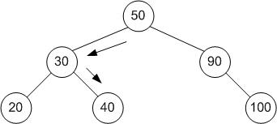

# Cây tìm kiếm nhị phân

<head>
<link rel="preconnect" href="https://fonts.gstatic.com">
<link href="https://fonts.googleapis.com/css2?family=Cinzel:wght@600&display=swap" rel="stylesheet">
</head>
<div style="display: flex; align-items: center;">

<span style="margin-left: 15px; color: #b71c1c;font-family: 'Cinzel', serif;">Tran Lam</span> <span style="margin-left: 15px;font-family: 'Cinzel', serif;">Feb 22,2021</span> <span style="margin-left: 15px;font-family: 'Cinzel', serif;" >15 min read</span>
</div>
<br/>

Trong quá trình học lập trình, bạn sẽ bắt gặp rất nhiều loại cấu trúc dữ liệu như: mảng, danh sách liên kết, từ điển (dictionary),... Mỗi loại cấu trúc dữ liệu có ưu điểm và nhược điểm riêng. Hôm nay, mình sẽ nói về loại cấu trúc dữ liệu khá thú vị là cây tìm kiếm nhị phân, một cấu trúc dữ liệu rất thuận lợi cho bài toán tìm kiếm.

### Các đề mục
[1. Đặt vấn đề](#1-Đặt-vấn-đề)

&nbsp;&nbsp;&nbsp;&nbsp;&nbsp;[1.1. Mảng/danh sách liên kết chưa sắp xếp](#11-mảngdanh-sách-liên-kết-chưa-sắp-xếp)

&nbsp;&nbsp;&nbsp;&nbsp;&nbsp;[1.2. Mảng đã sắp xếp](#12-mảng-đã-sắp-xếp)

&nbsp;&nbsp;&nbsp;&nbsp;&nbsp;[1.3. Danh sách liên kết được sắp xếp](#13-danh-sách-liên-kết-được-sắp-xếp)

&nbsp;&nbsp;&nbsp;&nbsp;&nbsp;[1.4. Cây heap](#14-cây-heap)

[2. Cây tìm kiếm nhị phân](#2-cây-tìm-kiếm-nhị-phân)

[3. Các hoạt động với cây tìm kiếm nhị phân](#3-các-hoạt-động-với-cây-tìm-kiếm-nhị-phân)

&nbsp;&nbsp;&nbsp;&nbsp;&nbsp;[3.1. Search - Tìm kiếm một giá trị trong cây](#31-search---tìm-kiếm-một-giá-trị-trong-cây)

&nbsp;&nbsp;&nbsp;&nbsp;&nbsp;[3.2. Insert - Chèn một node vào cây](#32-insert---chèn-một-node-vào-cây)

&nbsp;&nbsp;&nbsp;&nbsp;&nbsp;[3.3. Delete - Xóa một node trên cây](#33-delete---xóa-một-node-trên-cây)

&nbsp;&nbsp;&nbsp;&nbsp;&nbsp;[3.4. Traversal - Duyệt cây theo thứ tự](#34-traversal---duyệt-cây-theo-thứ-tự)

&nbsp;&nbsp;&nbsp;&nbsp;&nbsp;&nbsp;&nbsp;&nbsp;&nbsp;&nbsp;[3.4.1. Duyệt pre-order](#341-duyệt-pre-order)

&nbsp;&nbsp;&nbsp;&nbsp;&nbsp;&nbsp;&nbsp;&nbsp;&nbsp;&nbsp;[3.4.2. Duyệt in-order](#342-duyệt-in-order)

&nbsp;&nbsp;&nbsp;&nbsp;&nbsp;&nbsp;&nbsp;&nbsp;&nbsp;&nbsp;[3.4.3. Duyệt post-order](#343-duyệt-post-order)

[4. Mở rộng](#4-mở-rộng)

[5. Tài liệu tham khảo](#5-tài-liệu-tham-khảo)


### 1. Đặt vấn đề
Những bài toán thực tế mà chúng ta hay các doanh nghiệp giải quyết thường được phân ra các vấn đề nhỏ và áp dụng các thuật toán, cũng như cấu trúc dữ liệu phù hợp để đưa ra được cách làm, sao cho hiệu quả và đỡ tốn chi phí nhất. Vấn đề sau, mình xin lấy ví dụ tham khảo từ khóa học 6.006 của MIT, các bạn có thể truy cập **[tại đây](https://ocw.mit.edu/courses/electrical-engineering-and-computer-science/6-006-introduction-to-algorithms-fall-2011/lecture-videos/lecture-5-binary-search-trees-bst-sort/)**.

Giả sử hãng hàng không nọ có chương trình quản lý cho đường bay. Mỗi chuyến bay khi đến sân thì phải yêu cầu một lịch hạ cánh vào một thời điểm nhất định. Để không xảy ra xung đột nào, các thời điểm hạ cánh phải cách nhau ít nhất \\(k\\) phút \\((1)\\). Danh sách thời điểm hạ cánh là \\(R\\) gồm \\(n\\) phần tử. Làm sao thêm một thời điểm hạ cánh \\(t\\) để thỏa mãn ràng buộc \\((1)\\) ở trên.
Mình có hình ảnh cho bài toán thêm trực quan

<div style="text-align:center;">

</div>

Với số phần tử là \\(n\\), ta mong muốn thực hiện phép tìm vị trí thích hợp và chèn thời điểm bay mới trong thời gian hiệu quả, như \\(O(logn)\\).
Và sau đây sẽ là các mục đánh giá bài toán với một số cấu trúc dữ liệu cụ thể.

#### 1.1. Mảng/danh sách liên kết chưa sắp xếp
Quy trình chèn phần tử vào mảng chưa sắp xếp, mà không quan tâm đến điều kiện ràng buộc \\((1)\\), sẽ tốn \\(O(1)\\).
Quy trình chèn phần tử vào mảng chưa sắp xếp, mà quan tâm đến điều kiện ràng buộc \\((1)\\), sẽ tốn \\(O(n)\\).

Time complexity: \\(O(n)\\).

#### 1.2. Mảng đã sắp xếp

* Tìm vị trí phù hợp tốn \\(O(logn)\\) (sử dụng tìm kiếm nhị phân, nhìn vào phần tử trung vị và quyết định đi sang trái hay phải).
* So sánh với phần tử ở 2 bên của vị trí tốn \\(O(1)\\).
* Chèn phần tử vào vị trí thích hợp đó tốn \\(O(n)\\) (khi mà bạn có thể sẽ phải dịch phần lớn các phần tử lên 1 vị trí với trường hợp chèn phần tử vào đầu mảng).

Time complexity: \\(O(n)\\).

#### 1.3. Danh sách liên kết được sắp xếp
Việc chèn phần tử vào 1 linked list sẽ mất \\(O(1)\\). Nhưng việc tìm vị trí được chèn sẽ mất \\(O(n)\\) khi mà ta phải duyệt lần lượt từ head xuống vị trí đó.

<div style="text-align:center;">

</div>

#### 1.4. Cây heap
Với việc chèn vào cây min-heap hoặc max-heap
* Việc tìm vị trí chèn sẽ mất \\(O(n)\\) khi mà ta có thể phải duyệt tất cả phần tử.
* Việc chèn vào cây min/max heap là không ổn định, vì có thể sau khi chèn vào vị trí nào đó, ta phá vỡ tính chất của cây min/max heap và phải chạy **min/max-heapify** (ở bài viết [các thuật toán sắp xếp cơ bản](https://lam1051999.github.io/md_blogs/blogs/sorting_algorithms.html), mình cũng đã nói về **max-heapify**) để lấy lại được thuộc tính phù hợp. Việc chạy lại **min/max-heapify** sẽ không thể đảm bảo được điều kiện ràng buộc \\((1)\\).

*Chúng ta cần một cấu trúc dữ liệu tốt hơn để có thể thực hiện tìm vị trí thích hợp và chèn trong \\(O(logn)\\).*

### 2. Cây tìm kiếm nhị phân
Cây tìm kiếm nhị phân là cấu trúc dữ liệu thỏa mãn \\((2)\\)
* Mỗi node chỉ có tối đa 2 node con.
* Giá trị node con trái nhỏ hơn node cha.
* Giá trị node con phải lớn hơn node cha.
* Cây con trái và cây con phải cũng là một cây tìm kiếm nhị phân.

Mỗi node của cây gồm
* Giá trị của node.
* Con trỏ trỏ tới node con trái.
* Con trỏ trỏ tới node con phải. 

```python
class Node:
    def __init__(self, val, left=None, right=None):
        self.val = val
        self.left = left
        self.right = right
```

Các loại cây nhị phân:
* **Full binary tree:** mỗi node của cây có 0 hoặc 2 node con.
* **Complete binary tree:** các tầng đều chứa đầy node ngoại trừ tầng cuối, và các node tầng cuối phải được điền đầy từ trái sang phải.
* **Degenerate binary tree:** cây mà tất cả các node cha đều chỉ có 1 node con.
* **Perfect binary tree:** internal node nào cũng có 2 node con và các leaf ở cũng một mức.
* **Balanced binary tree:** chiều cao của cây con trái và cây con phải chênh lệch nhau nhiều nhất là 1.

Dưới đây là hình ảnh minh họa

<div style="text-align:center;">

</div>

### 3. Các hoạt động với cây tìm kiếm nhị phân
Xét cây có \\(n\\) node, chiều cao là \\(h\\).

#### 3.1. Search - Tìm kiếm một giá trị trong cây
Tìm kiếm một khóa trên cây, ta thực hiện bằng phương pháp đệ quy. Bắt đầu từ gốc, ta so sánh giá trị của node gốc với khóa. Nếu giá trị node gốc nhỏ hơn khóa, ta phải tìm nó trên cây con trái, nếu giá trị node gốc lớn hơn khóa, ta tìm khóa đó trên cây con phải. Ta thực hiện điều này với tất cả node ta đi tới. Nếu giá trị node bằng khóa, ta trả về node đó. Nếu giá trị node là rỗng, ta kết luận không tìm thấy khóa trên cây.

<div style="text-align:center;">

</div>

Ví dụ tìm khóa \\(40\\). Ta so sánh \\(40 < 50\\), đi xuống cây con trái để xét. Ta so sánh \\(40 > 30\\), đi xuống cây con phải để xét. Cuối cùng, ta tìm được node có giá trị là \\(40\\).

**Code Python**
```python
def search(root, key):
    if root is None:
        print("Cannot find the key " + key +  " in bst")
        return None
    # tiếp tục duyệt
    if root.val < key:
        return search(root.right, key)
    elif root.val > key:
        return search(root.left, key)
    else:
        return root
```

**Phân tích thuật toán**: tìm kiếm khóa trong cây tốn \\(O(h)\\).
* **Average case:** chiều cao cây \\(h = \Theta(logn)\\), nên time complexity sẽ là \\(O(logn)\\).
* **Worst case:** khi cây là một degenerate binary tree, chiều cao cây \\(h = n\\) nên time complexity là \\(O(n)\\).

#### 3.2. Insert - Chèn một node vào cây
Quá trình chèn một node có giá trị nhất định cây diễn ra cũng có quy trình đi khá giống với search. Ta duyệt như vậy cho đến khi gặp node rỗng thì ta chèn node cần chèn vào vị trí đó. Trong quá trình duyệt, ta tìm thấy node nào đó có giá trị bằng khóa, ta trả về node đó.

<div style="text-align:center;">

</div>

Ví dụ chèn khóa \\(4\\). So sánh \\(4 < 6\\), thực hiện đi xuống cây con trái, so sánh \\(4 > 3\\), thực hiện đi xuống cây con phải. Thấy vị trí cây con phải rỗng, ta chèn node khóa \\(4\\) tại vị trí đó.

**Code Python**
```python
def insert(root, key):
    # đã tới leaf
    if root is None:
        return Node(key)
    # tiếp tục duyệt. Nếu bất ngờ gặp node có giá trị bằng khóa, trả về node đó. 
    else:
        if root.val == key:
            return root
        elif root.val < key:
            root.right = insert(root.right, key)
        else:
            root.left = insert(root.left, key)
            
    return root
```

**Phân tích thuật toán**: tìm kiếm vị trí cần chèn trong cây tốn \\(O(h)\\), chèn tốn \\(O(1)\\). Do vậy, time complexity là \\(O(h)\\).
* **Average case:** chiều cao cây \\(h = \Theta(logn)\\), nên time complexity sẽ là \\(O(logn)\\).
* **Worst case:** khi cây là một degenerate binary tree, chiều cao cây \\(h = n\\) nên time complexity là \\(O(n)\\).

**Giải quyết vấn đề ở mục 1:** do tại bước chèn node vào trong cây, ta thấy được rằng ta có thể thêm vào các câu lệnh điều kiện để có chấp thuận việc chèn hay không mà không làm ảnh hưởng đến các tính chất ở \\((2)\\) của cây tìm kiếm nhị phân.

<div style="text-align:center;">

</div>

Như với cây trên, trường hợp \\(k = 3\\). Ta muốn chèn \\(45\\). Tại bước xét node \\(40\\), ta thấy \\(45 - 40 > 3\\), nên bước tiếp theo sẽ chèn \\(45\\), mà không làm mất đi các tính chất của cây. Nếu ta muốn chèn \\(42\\), ta xét \\(42 - 40 < 3\\), ta không thực hiện chèn node.

#### 3.3. Delete - Xóa một node trên cây
Quá trình xóa một node trên cây tìm kiếm nhị phân xảy ra trong 3 trường hợp
* Node cần xóa không có node con. 
* Node cần xóa có 1 node con.
* Node cần xóa có cả 2 node con.

**Trường hợp 1:** Node cần xóa không có node con

<div style="text-align:center;">

</div>

Ví dụ với việc xóa node có khóa \\(40\\) ở cây trên, ta chỉ việc giải phóng nó khỏi cây.

**Trường hợp 2:** Node cần xóa có 1 node con

<div style="text-align:center;">

</div>

Ví dụ với việc xóa node có khóa \\(90\\) ở cây trên, ta chỉ cần thay thế node đó với node con duy nhất của nó.

**Trường hợp 3:** Node cần xóa có 2 node con, ta thay thế nó bằng node có khóa lớn nhất ở cây con trái của nó (node cực phải của cây con trái), hoặc node có khóa nhỏ nhất ở cây con phải của nó (node cực trái của cây con phải).

<div style="text-align:center;">

</div>

Ví dụ với việc xóa node có khóa \\(30\\) ở cây trên, ta tìm node có khóa nhỏ nhất ở cây con phải của nó, là \\(35\\), và thay thế node có khóa \\(35\\) vào vị trí node có khóa \\(30\\). Sau đó, ta nhận ra rằng, node có khóa \\(35\\) ở vị trí cũ là node có 1 node con. Nên ta cũng áp dụng quy trình xóa node như **Trường hợp 2** cho vị trí đó.

**Code Python**
```python
# tìm node trái nhất tại cây con phải
def find_min(root):
    current = root
    # đi đến node trái nhất của cây con phải
    while current.left is not None:
        current = current.left
    return current

def delete(root, key):
    if root is None:
        return root
    # tiếp tục duyệt cho đến khi tìm thấy node có giá trị là khóa
    if root.val < key:
        root.right = delete(root.right, key)
    elif root.val > key:
        root.left = delete(root.left, key)
    else:
        # trường hợp 1
        if root.left is None and root.right is None:
            root = None
            return root
        # trường hợp 2
        elif root.left is None:
            root.val = root.right.val
            root.right = None
            return root
        elif root.right is None:
            root.val = root.left.val
            root.left = None
            return root
        # trường hợp 3
        else:
            temp = find_min(root.right)
            root.val = temp.val
            root.right = delete(root.right, temp.val)
            return root

    return root
```

**Phân tích thuật toán**:
* **Trường hợp 1:** tìm node tốn \\(O(h)\\), xóa node tốn \\(O(1)\\). Do vậy, time complexity là \\(O(h)\\).
* **Trường hợp 2:** tìm node tốn \\(O(h)\\), xóa node tốn \\(O(1)\\), chuyển node tốn \\(O(1)\\). Do vậy, time complexity là \\(O(h)\\).
* **Trường hợp 3:** tìm node tốn \\(O(h)\\), tìm node trái nhất trên cây con phải tốn \\(O(h)\\), xóa node trái nhất trên cây con phải tốn \\(O(h)\\). Do vậy, time complexity là \\(O(h)\\).
* **Average case:** chiều cao cây \\(h = \Theta(logn)\\), nên time complexity sẽ là \\(O(logn)\\).
* **Worst case:** khi cây là một degenerate binary tree, chiều cao cây \\(h = n\\) nên time complexity là \\(O(n)\\).

#### 3.4. Traversal - Duyệt cây theo thứ tự
Việc duyệt và in ra các giá trị của các node trong cây có 3 cách duyệt: pre-order, in-order, post-order

Xét cây sau \\((3)\\)

<div style="text-align:center;">

</div>

##### 3.4.1. Duyệt pre-order
Ta duyệt node cha trước, đến node con trái và sau đó đến node con phải.

Ví dụ với cây \\((3)\\), duyệt pre-order, kết quả là \\(6, 3, 1, 10, 9, 12\\).

**Code Python**
```python
def preorder(root):
    if root:
        print(root.val)
        preorder(root.left)
        preorder(root.right)
```

##### 3.4.2. Duyệt in-order
Ta duyệt node con trái trước, đến node cha và sau đó đến node con phải.

Ví dụ với cây \\((3)\\), duyệt pre-order, kết quả là \\(1, 3, 6, 9, 10, 12\\).

**Code Python**
```python
def inorder(root):
    if root:
        inorder(root.left)
        print(root.val)
        inorder(root.right)
```

##### 3.4.3. Duyệt post-order
Ta duyệt node con trái trước, đến node con phải và sau đó đến node cha.

Ví dụ với cây \\((3)\\), duyệt pre-order, kết quả là \\(1, 3, 9, 12, 10, 6\\).

**Code Python**
```python
def postorder(root):
    if root:
        postorder(root.left)
        postorder(root.right)
        print(root.val)
```

**Phân tích thuật toán**:
Ta duyệt hết các node trên cây nên time complexity là \\(O(n)\\).

### 4. Mở rộng
Cây tìm kiếm nhị phân là cấu trúc thú vị và hiệu quả. Bạn đọc có thể tìm thấy visualization cho các hoạt động của cây tìm kiếm nhị phân để trực quan hơn **[tại đây](https://www.cs.usfca.edu/~galles/visualization/BST.html)**.

<br/>
<br/>
<br/>

### 5. Tài liệu tham khảo

[https://www.geeksforgeeks.org/binary-search-tree-set-1-search-and-insertion/](https://www.geeksforgeeks.org/binary-search-tree-set-1-search-and-insertion/)

[https://vi.wikipedia.org/wiki/C%C3%A2y_t%C3%ACm_ki%E1%BA%BFm_nh%E1%BB%8B_ph%C3%A2n](https://vi.wikipedia.org/wiki/C%C3%A2y_t%C3%ACm_ki%E1%BA%BFm_nh%E1%BB%8B_ph%C3%A2n)

[https://codelearn.io/sharing/5-phut-thong-thao-binary-search-tree](https://codelearn.io/sharing/5-phut-thong-thao-binary-search-tree)