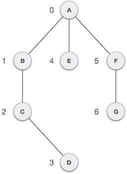

# Các thuật toán tìm đường đơn giản trên đồ hình

<head>
<link rel="preconnect" href="https://fonts.gstatic.com">
<link href="https://fonts.googleapis.com/css2?family=Cinzel:wght@600&display=swap" rel="stylesheet">
</head>

Tran Lam Feb 22,2021 15 min read

 

Một trong những cấu trúc dữ liệu khiến phần lớn các bạn mới học lập trình ngao ngán đó chính là đồ hình. Bởi trong một đồ hình nhiều nút, nếu bạn không triển khai được các thuật toán tối ưu thì chương trình sẽ chạy lâu và dễ bị duyệt lặp nhiều lần.

### Các đề mục

giới thiệu đồ hình
    thành phần trong đồ hình
        vertex
        edge
        adjacency
        path
        Các loại khác
    loại đồ hình
        có hướng
        vô hướng
    ứng dụng
Các giải thuật
    DFS
    BFS
    Dijkstra
    Bellman-Ford

### 1. Giới thiệu về đồ hình

Đồ hình là kiểu dữ liệu trừu tượng (abstract data structure) được xây dựng bởi một số hữu hạn các nút (vertices) và tập các cạnh (edges) kết nối các nút với nhau.

#### 1.1. Các thành phần trong đồ hình

Với đồ hình sau

##### 1.1.1. Các nút (vertex)

