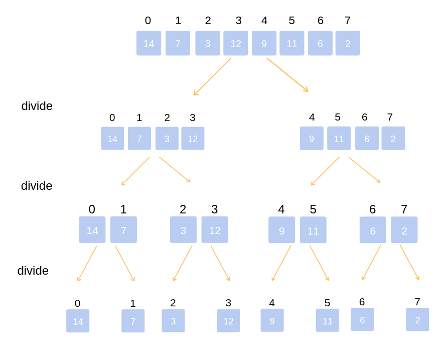
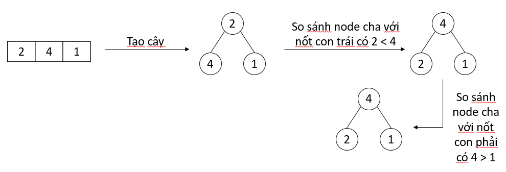

# Các thuật toán sắp xếp cơ bản

<head>
<link rel="preconnect" href="https://fonts.gstatic.com">
<link href="https://fonts.googleapis.com/css2?family=Cinzel:wght@600&display=swap" rel="stylesheet">
</head>
<div style="display: flex; align-items: center;">

<span style="margin-left: 15px; color: #b71c1c;font-family: 'Cinzel', serif;">Tran Lam</span> <span style="margin-left: 15px;font-family: 'Cinzel', serif;">Feb 20,2021</span> <span style="margin-left: 15px;font-family: 'Cinzel', serif;" >25 min read</span>
</div>
<br/>

Trở lại thôi. Những blogs đầu tiên này mình sẽ chỉ viết về những thuật toán cơ bản nhất khi mới chập chững vào học lập trình thôi. Thứ nhất, để mình học lại các thứ cơ bản (vì mình cực kì hay quên). Thứ hai, để các bạn mới học lập trình có thể tham khảo ha. Bài viết này sẽ nói về các thuật toán sắp xếp cơ bản mình được học ở trường lớp, và cũng tự học nữa.

### Các đề mục
[1. Tại sao chúng ta cần những thuật toán sắp xếp?](#1-tại-sao-chúng-ta-cần-những-thuật-toán-sắp-xếp)

[2. Sắp xếp nổi bọt (bubble sort)](#2-sắp-xếp-nổi-bọt-bubble-sort)

[3. Sắp xếp chèn (insertion sort)](#3-sắp-xếp-chèn-insertion-sort)

[4. Sắp xếp lựa chọn (selection sort)](#4-sắp-xếp-lựa-chọn-selection-sort)

[5. Sắp xếp trộn (merge sort)](#5-sắp-xếp-trộn-merge-sort)

[6. Sắp xếp vun đống (heap sort)](#6-sắp-xếp-vun-đống-heap-sort)

[7. Sắp xếp nhanh (quick sort)](#7-sắp-xếp-nhanh-quick-sort)

[8. Sắp xếp đếm (counting sort)](#8-sắp-xếp-đếm-counting-sort)

[9. Tài liệu tham khảo](#9-tài-liệu-tham-khảo)


### 1. Tại sao chúng ta cần những thuật toán sắp xếp?
**Thứ nhất**, đơn giản là chỉ để qua các kì thi ở trường đại học, học mấy môn Ngôn ngữ lập trình, Cấu trúc dữ liệu và giải thuật,... đi thi dễ bị hỏi mấy cái sắp xếp này lắm luôn.

**Thứ hai**, khâu sắp xếp phần tử thường là khâu trung gian, tiền xử lý dữ liệu trong các bài toán, hệ thống xử lý,... để thực hiện các công việc lớn hơn sau nó. Vì lượng dữ liệu trong các hệ thống thực tế luôn rất lớn, nên ta cần các thuật toán sắp xếp hiệu quả để đỡ tốn chi phí nhất (thời gian và bộ nhớ).

**Các ví dụ đơn giản về áp dụng thuật toán sắp xếp**
* Sắp xếp danh sách khách hàng theo tên trong tệp tin quản lý.
* Tìm phần tử trung vị trong \\(\Theta(1)\\), hay là tìm kiếm 1 phần tử nào đó với \\(\Theta(logn)\\) nếu như có một mảng đã được sắp xếp.
* Database sử dụng các thuật toán merge sort để sắp xếp các tập dữ liệu khi chúng quá lớn để load cả cục vào bộ nhớ.
* Tìm kiếm file, nén dữ liệu, tìm đường đi.
* Các trình thiết kế đồ họa cũng sử dụng thuật toán để sắp xếp các tầng (layers) để render thế nào cho hiệu quả.
* Ăn xong cỗ, mẹ bạn bắt bạn rửa bát. Bạn vật lộn với chục chồng bát trong 1 tiếng lận và giờ bạn không muốn mất thêm bất cứ thời gian nào cho đống bát kia nữa. Hóa ra, công việc còn lại là sắp xếp đồng bát vào trạn sao cho ngăn nắp, đẹp và hơn hết là nhanh chóng để bạn còn đi nghịch điện thoại. Theo bản năng của tất cả người châu Á trí thông minh trung bình đổ lên, bạn đã sắp xếp chúng rất nhanh và chồng nhỏ đến chồng to rất bắt mắt, sau đó, bạn nhận ra là mình đã vô tình áp dụng Counting Sort vào việc này.

**Các phép toán cơ bản sử dụng trung gian**
* Phép toán so sánh 2 phần tử \\((a, b)\\), trả về \\(True\\) nếu \\((a > b)\\), trả về \\(False\\) nếu ngược lại.
* Phép toán đổi chỗ 2 phần tử \\((a, b)\\), trong Python sẽ được thực hiện như sau
```python
a, b = b, a
```
Trong quá trình phân tích các thuật toán, ta giả sử rằng các phép toán trên chỉ tốn constant time \\(\Theta(1)\\).

### 2. Sắp xếp nổi bọt (bubble sort)
Sắp xếp nổi bọt là loại sắp xếp đơn giản và kém hiệu quả, thường được dạy trong hầu hêt tất cả các course về thuật toán bởi nó khá trực quan. Sắp xếp nổi bọt so sánh từng cặp số trong một mảng và hoán đổi vị trí cho nhau nếu chúng không theo thứ tự. Những phần tử lớn nhất sẽ được đẩy xuống cuối mảng, trong khi những phần tử nhỏ sẽ dần dần "nổi lên" đầu mảng.

**Thuật toán:**
* So sánh \\(arr[0]\\) với \\(arr[1]\\), nếu \\(arr[0] > arr[1]\\), hoán đổi vị trí của chúng. Tiếp tục làm như vậy cho với (\\(arr[1], arr[2]\\)), (\\(arr[2], arr[3]\\)),...
* Thực hiện bước \\(n\\) lần.
Để trực quan hơn, mình đem ra hình ảnh mô tả sau

<div style="text-align:center;">

</div>

**Phân tích thuật toán:**
* **Best case:** xảy ra khi ta áp dụng thuật toán trên mảng đã được sắp xếp. Khi đó, sẽ không có bước swap nào trong lần duyệt đầu tiên, chỉ có các bước so sánh, từ đó thì thuật toán sẽ kết thúc luôn sau lần duyệt này.
Vì thế, time complexity sẽ là \\(\Theta(n)\\).
Vì lý do này, bubble sort cũng được dùng để kiểm tra xem một mảng đã được sắp xếp hay chưa.
* **Worst case:** xảy ra khi mảng bị sắp xếp theo chiều ngược lại, do đó, có \\(n-1\\) phép so sánh và hoán đổi sẽ được thực hiện trong lần duyệt đầu tiên, \\(n-2\\) phép so sánh và hoán đổi sẽ được thực hiện trong lần duyệt tiếp theo,...
Vì thế, tổng số phép so sánh và hoán đổi sẽ là \\(Sum = (n-1) + (n-2) +...+ 2 + 1 = \frac{n \times (n-1)}{2}\\). Do đó, time complexity sẽ là \\(\Theta(n^2)\\).
* **Space complexity:** \\(\Theta(1)\\).

**Code Python**
```python
ini_arr = [1, 5, 2, 45, 2, 32, 12, 55, 26, 77, 8]

def bubble_sort(arr):
    for i in range(len(arr)):
        swapped = False
        for j in range(len(arr) - i - 1):
            if arr[j] > arr[j+1]:
                arr[j], arr[j+1] = arr[j+1], arr[j]
                swapped = True
        if not swapped:
            return

bubble_sort(ini_arr)
print(ini_arr)
```
Output
```python
[1, 2, 2, 5, 8, 12, 26, 32, 45, 55, 77]
```

### 3. Sắp xếp chèn (insertion sort)
Tưởng tượng bạn chơi tiến lên miền Nam, khi mới được phát xong bộ bài trong tay, bạn có nhiều cách sắp xếp tùy theo cá tính của bạn. Với mình, mình thường sắp xếp theo thứ tự quân bài từ bé đến lớn. Những lúc muốn sắp 1 lá bài mới vào bộ quân bài trên tay đã theo thứ tự, mình thực hiện chèn lá bài vào vị trí thích hợp, và đó cũng là ý tưởng của insertion sort.

**Thuật toán:**
Với \\(i = 1, 2,..., n - 1\\), ta sẽ chèn \\(arr[i]\\) vào trong mảng đã sắp xếp \\(arr[0:i-1]\\) bằng việc thực hiện dịch lần lượt các phần tử lớn hơn \\(arr[i]\\) của mảng \\(arr[0:i-1]\\) lên và đặt \\(arr[i]\\) vào đúng vị trí thích hợp.
Để trực quan hơn, mình đem ra hình ảnh mô tả sau

<div style="text-align:center;">

</div>

**Phân tích thuật toán:**
* **Best case:** xảy ra khi ta áp dụng thuật toán với mảng đã được sắp xếp. Khi đó, ta chỉ cần duyệt qua 1 lượt mảng, chỉ so sánh và không cần thực hiện một bước hoán đổi nào cả.
Vì thế, time complexity sẽ là \\(\Theta(n)\\).
* **Worst case:** xảy ra khi mảng bị sắp xếp theo chiều ngược lại, sẽ có 1 phép so sánh và gán trong lần duyệt đầu tiên, 2 phép so sánh và gán trong lần dịch thứ hai,...
Vì thế, tổng số phép so sánh và gán sẽ là \\(Sum = 1 + 2 +...+ (n-1) = \frac{n \times (n-1)}{2}\\). Do đó, time complexity sẽ là \\(\Theta(n^2)\\).
* **Space complexity:** \\(\Theta(1)\\).

**Code Python**
```python
ini_arr = [1, 5, 2, 45, 2, 32, 12, 55, 26, 77, 8]

def insertion_sort(arr):
    for key in range(1, len(arr)):
        value = arr[key]
        j = key - 1
        while j >= 0 and value < arr[j]:
            arr[j+1] = arr[j]
            j -= 1
        if key != j+1:
            arr[j+1] = value

insertion_sort(ini_arr)
print(ini_arr)
```
Output
```python
[1, 2, 2, 5, 8, 12, 26, 32, 45, 55, 77]
```

### 4. Sắp xếp lựa chọn (selection sort)
Ý tưởng là ta sẽ **giả định** chia mảng của ta ra làm 2 phần: mảng con được sắp xếp \\(arr{_1}\\) và mảng con chưa được sắp xếp \\(arr{_2}\\). Lúc này, \\(arr = (arr{_1})(arr{_2})\\).
Ta sẽ lần lượt tìm phần tử nhỏ nhất của \\(arr{_2}\\), tách ra và đẩy phần tử đó sang \\(arr{_1}\\). Mình nói **giả định** ở đây là sao, là chúng ta không thực sự tạo ra 2 mảng con mới, mà các hoạt động đều được thực hiện trên mảng gốc.

**Thuật toán:**
* Tìm phần tử nhỏ nhất của \\(arr{_2}\\).
* Hoán đổi vị trí của phần tử nhỏ nhất ấy với phần tử đầu tiên của \\(arr{_2}\\). Lúc này, ta xem như \\(arr{_2}\\) đã không còn phần tử nhỏ nhất đó, và giờ phần từ nhỏ nhất đó đã ghép vào \\(arr{_1}\\).

Mình có hình ảnh để thuật toán thêm trực quan hơn

<div style="text-align:center;">

</div>

**Phân tích thuật toán:**
* **Best case:** xảy ra khi áp dụng thuật toán trên mảng đã sắp xếp, ta chỉ phải so sánh chứ không cần thực hiện hoán đổi vị trí.
Vì thế, time complexity sẽ là \\(\Theta(n)\\).
* **Worst case:** xảy ra khi mảng trên được sắp xếp theo chiều ngược lại, mỗi lần duyệt ta phải tìm phần tử nhỏ nhất của mảng con \\(arr{_2}\\).
Vì thế, tổng số phép duyệt để tìm các phần tử nhỏ nhất sẽ là \\(Sum = (n-1) + (n-2) +...+ 1 = \frac{n \times (n-1)}{2}\\). Do đó, time complexity sẽ là \\(\Theta(n^2)\\).
* **Space complexity:** \\(\Theta(1)\\).

**Code Python**
```python
ini_arr = [1, 5, 2, 45, 2, 32, 12, 55, 26, 77, 8]

def selection_sort(arr):
    for i in range(len(arr) - 1):
        min_index = i
        for j in range(i+1, len(arr)):
            if arr[j] < arr[min_index]:
                min_index = j
        if i != min_index:
            arr[min_index], arr[i] = arr[i], arr[min_index]

selection_sort(ini_arr)
print(ini_arr)
```
Output
```python
[1, 2, 2, 5, 8, 12, 26, 32, 45, 55, 77]
```

### 5. Sắp xếp trộn (merge sort)
Sắp xếp trộn là một trong những thuật toán hiệu quả nhất. Thuật toán hoạt động dựa trên nguyên tắc chia và trị, lần lượt tách các mảng ra 2 mảng con cho đến khi các mảng con chỉ còn 1 phần tử. Sau đó, thuật toán "trộn" các mảng con đó thành mảng được sắp xếp hoàn chỉnh.

**Thuật toán:**
* Lần lượt chia mảng gốc thành 2 mảng con, 2 mảng con thành 4 mảng con nữa,... đến khi ta được \\(n\\) mảng con, mỗi mảng con chứa 1 phần tử.

<div style="text-align:center;">

</div>

* Trộn các mảng con để tạo ra mảng lớn hơn được sắp xếp theo thứ tự cho đến khi ta nhận được 1 mảng duy nhất. Đó chính là mảng đã được sắp xếp từ mảng gốc.

<div style="text-align:center;">

</div>

Tổng kết lại thuật toán trong 1 hình ảnh

<div style="text-align:center;">

</div>

**Phân tích thuật toán:**
* **Tách mảng:** thuật toán sẽ tính toán điểm giữa của mảng bằng việc lấy chiều dài mảng rồi chia 2, do đó, tốn constant time \\(\Theta(1)\\) để chia mảng ra làm 2 mảng con.
* **Sắp xếp mảng con:** giả sử sắp xếp mảng tốn \\(T(n)\\) time. Như vậy để sắp xếp 2 mảng con, ta tốn \\(2T(\frac{n}{2})\\) time.
* **Trộn 2 mảng con:** sử dụng thuật toán "2 ngón tay", mỗi ngón trỏ tới vị trí đầu của mỗi mảng con. Chúng ta lần lượt so sánh 2 số tại 2 vị trí mà 2 ngón tay trỏ đến và chọn số bé hơn để đẩy vào mảng kết quả. Cứ phần tử ở mảng con nào được đẩy vào, ta đưa ngón tay trỏ tới phần tử tiếp theo của mảng đó. Việc này khiến ta phải duyệt qua \\(2 \times \frac{n}{2} = n\\) phần tử, do đó, ta tốn \\(\Theta(n)\\).
Như vậy, ta có biểu thức sau
<div style="text-align: center;">

\\(T(n) = \Theta(1) + 2T(\frac{n}{2}) + \Theta(n)\\)

</div>

Với base case ở đây là \\(T(1) = \Theta(1)\\).

<div style="text-align:center;">

</div>

Với mỗi mức thuật toán thực hiện \\(\Theta(n)\\) công việc, có \\(1+logn\\) mức. Do đó, \\(T(n) = \Theta(n + nlogn) = \Theta(nlogn)\\). Thuật toán sẽ có time complexity là \\(\Theta(nlogn)\\).
* **Space complexity:** Vì trong bước "trộn", ta phải tự tạo ra 2 mảng con, mỗi mảng con có số phần tử là \\(\frac{n}{2}\\), do vậy, không gian bộ nhớ phụ trợ sẽ là \\(\Theta(n)\\).

**Code Python**
```python
import math
ini_arr = [1, 5, 2, 45, 2, 32, 12, 55, 26, 77, 8]

def merge(arr, l, m, r):
    n1 = m - l + 1
    n2 = r - m
    L = []
    R = []
    for i in range(n1):
        L.append(arr[l+i])
    for j in range(n2):
        R.append(arr[m+j+1])
    i = 0
    j = 0
    k = l
    while i < n1 and j < n2:
        if L[i] <= R[j]:
            arr[k] = L[i]
            i += 1
        else:
            arr[k] = R[j]
            j += 1
        k += 1
    while i < n1:
        arr[k] = L[i]
        i += 1
        k += 1
    while j < n2:
        arr[k] = R[j]
        j += 1
        k += 1

def merge_sort(arr, l, r):
    if l < r:
        m = math.floor(l + (r-l)/2)
        merge_sort(arr, l, m)
        merge_sort(arr, m+1, r)
        merge(arr, l, m, r)

merge_sort(ini_arr, 0 ,len(ini_arr) - 1)
print(ini_arr)
```
Output
```python
[1, 2, 2, 5, 8, 12, 26, 32, 45, 55, 77]
```

### 6. Sắp xếp vun đống (heap sort)
Sắp xếp vun đống lấy dựa trên cấu trúc dữ liệu binary heap.

**Cấu trúc dữ liệu binary heap:**
Một mảng dữ liệu có thể được biểu diễn dưới dạng cây nhị phân như sau

<div style="text-align:center;">

</div>

Với mỗi node bất kỳ với chỉ số tương ứng là \\(i\\) trong cây nhị phân ở trên
* Node cha của \\(i\\) sẽ có chỉ số \\(parent(i)\\) là \\(\Bigl\lfloor\dfrac{i}{2}\Bigr\rfloor\qquad\\).
* Node con trái sẽ có chỉ số \\(leftchild(i)\\) là \\(2i\\).
* Node con phải sẽ có chỉ số \\(rightchild(i)\\) là \\(2i + 1\\).

Có 2 kiểu của cấu trúc dữ liệu này đó là: max-heap và min-heap.
* Trong max-heap, ta luôn có \\(A[parent(i)] \ge A[i\]\\). Do vậy, phần tử lớn nhất nằm ở root, còn phần tử nhỏ nhất nằm ở leaf.
* Trong min-heap, ta luôn có \\(A[parent(i)] \le A[i\]\\). Do vậy, phần tử nhỏ nhất nằm ở root, còn phần tử lớn nhất nằm ở leaf.

Từ đó, thuật toán sắp xếp này áp dụng max-heap hoặc min-heap (trong bài này mình sẽ dùng max-heap) để tạo ra mảng sắp xếp theo thứ tự.

**Tạo max-heap:** gọi là **max_heapify**
Mình sẽ đưa ra ví dụ đơn giản với mảng 3 phần tử để thêm trực quan, còn với mảng n phần tử sẽ cần làm theo một cách tổng quát hơn

<div style="text-align:center;">

</div>

Code python cho **max_heapify** tại một node có chỉ số \\(i = index\\), \\(length\\) là chiều dài của mảng, thêm vào để làm điều kiện ràng buộc cho chỉ số các node con. Thuật toán ở dưới nói rằng, nếu node ở chỉ số \\(i = index\\) chưa đúng với quy luật max-heap, ta sẽ **max_heapify** lại cây với root là node đó, đồng thời **max_heapify** lại các cây với root là các node con trái và phải của node đó.
```python
def max_heapify(arr, length, index):
    l = (index + 1) * 2 - 1
    r = (index + 1) * 2
    largest = index
    if l < length and arr[index] < arr[l]:
        largest = l
    if r < length and arr[largest] < arr[r]:
        largest = r
    if largest != index:
        arr[index], arr[largest] = arr[largest], arr[index]
        max_heapify(arr, length, largest)
```
**max_heapify** này sẽ tốn \\(\Theta(logn)\\) với mỗi node được xét. Bởi vì mỗi lần, node đó sẽ cần phải đi xuống 1 cấp trên cây để xét, thuật toán sẽ chọn đúng nhánh để đi xuống và nó sẽ không backtrack lại lên trên. Do vậy, đường đi dài nhất thuật toán này có thể phải duyệt là từ root đến 1 leaf, là chiều cao của cây. Chiều cao của cây nhị phân có \\(n\\) node là \\(\Theta(logn)\\).

**Thuật toán:**
* Ta biểu diễn mảng và sắp xếp các phần tử để có một cây max-heap. Do đó, root của cây này (khi này sẽ tương ứng với phần tử có chỉ số là \\(i = 0\\) trong mảng, với \\(i = 0, 1,..., n-1\\)) sẽ là phần tử lớn nhất.
* Ta hoán đổi vị trí của root \\(arr[0]\\) với phần tử cuối cùng của mảng \\(arr[n-1]\\). Lúc này, phần tử lớn nhất của mảng đã nằm ở vị trí cuối cùng.
* Làm lại bước 1 và 2 với phần mảng còn lại \\(arr[0:n-2]\\),...

**Phân tích thuật toán:**
Xây dựng một cây max-heap từ mảng chưa sắp xếp cần \\(\Theta(n)\\) lời gọi hàm **max_heapify**, mỗi lời gọi **max_heapify** tốn \\(\Theta(logn)\\) time. Như vậy, toàn bộ thuật toán có time complexity là \\(\Theta(nlogn)\\).
Tuy vậy, thuật toán heap sort có ưu điểm hơn so với merge sort đó là nó chỉ sử dụng \\(\Theta(1)\\) bộ nhớ tạm thời, trong khi merge sort là \\(\Theta(n)\\). Nếu yếu tố bộ nhớ cũng quan trọng trong hệ thống của bạn (giả dụ các hệ thống bộ nhớ nhỏ như hệ thống nhúng,...), bạn hãy cân nhắc dùng heap sort hơn là merge sort. 

**Code Python**
```python
import math
ini_arr = [1, 5, 2, 45, 2, 32, 12, 55, 26, 77, 8]

def max_heapify(arr, length, index):
    l = (index + 1) * 2 - 1
    r = (index + 1) * 2
    largest = index
    if l < length and arr[index] < arr[l]:
        largest = l
    if r < length and arr[largest] < arr[r]:
        largest = r
    if largest != index:
        arr[index], arr[largest] = arr[largest], arr[index]
        max_heapify(arr, length, largest)

def heap_sort(arr):
    length = len(arr)
    last = math.floor(length / 2)
    # Tại đây, chỉ duyệt từ phần tử n/2 đổ về, vì phần tử từ n/2 + 1,..., n đều là leaves. Các leaves đã được thỏa mãn tính chất max-heap
    for i in range(last - 1, -1, -1):
        max_heapify(arr, length, i)
    for i in range(length - 1, 0, -1):
        arr[i], arr[0] = arr[0], arr[i]
        max_heapify(arr, i, 0)

heap_sort(ini_arr)
print(ini_arr)
```
Output
```python
[1, 2, 2, 5, 8, 12, 26, 32, 45, 55, 77]
```

### 7. Sắp xếp nhanh (quick sort)
Thuật toán sắp xếp nhanh được phát triển bởi một nhà khoa học máy tính người Anh Tony Hoare vào năm 1959, sử dụng nguyên lý chia và trị để sắp xếp 1 mảng.

**Thuật toán:**
* **Chia mảng:** 
    * Chọn một phần tử bất kỳ (gọi là pivot), \\(A[m]\\).
    Nếu ta chọn được 1 pivot tốt thì thuật toán của ta sẽ chạy rất nhanh. Tuy nhiên, sẽ rất khó để biết được phần tử nào được coi là 1 pivot tốt. Có một vài cách chọn pivot phổ biến sau:
        * Chọn pivot ngẫu nhiên.
        * Chọn phần tử trái nhất hoặc phải nhất.
        * Lấy 3 phần tử: đầu tiên, ở giữa, cuối cùng của mảng và chọn ra phần tử trung vị từ chúng.
    * Chia mảng của ta ra làm 2 phần con: \\(A[l:m-1]\\) gồm các phần tử nhỏ hơn \\(A[m]\\), và \\(A[m+1:r]\\) chứa các phần tử lớn hơn \\(A[m]\\).
    Hình ảnh dưới đây thể hiện trực quan hơn cách chia mảng, với pivot luôn lấy là phần tử cuối cùng

<div style="text-align:center;">

</div>

* **Trị:** sắp xếp một cách đệ quy 2 phần con trên bằng quick sort.
* **Kết hợp:** không cần kết hợp các phần con được chia vì kết quả cuối cùng đã cho mảng sắp xếp theo thứ tự.
* **Thuật toán đệ quy hoàn chỉnh:**
    * Chọn một pivot. Chia mảng ra làm 2 phần dựa trên pivot.
    * Áp dụng quick sort trên phần nửa nhỏ hơn pivot.
    * Áp dụng quick sort trên phần nửa lớn hơn pivot.

**Phân tích thuật toán:**
<div style="text-align: center;">

\\(T(n) = T(k) + T(n-k-1) + \Theta(n)\\)

</div>

Với \\(k\\) là số phần tử nhỏ hơn pivot. Time complexity cho quá trình **partition** là \\(\Theta(n)\\).

* **Best case:** xảy ra khi thuật toán chia nửa **partition** luôn chia được mảng của ta thành đúng 2 phần bằng hoặc gần bằng nhau.

<div style="text-align:center;">

</div>

Như vậy, ở best case, time complexity sẽ là \\(\Theta(nlogn)\\).
* **Worst case:** xảy ra khi **partition** luôn chọn phải số lớn nhất hoặc số nhỏ nhất làm pivot. Nếu như ta chọn pivot theo chiến thuật "luôn chọn phần tử cuối của mảng", worst case sẽ xảy ra khi mà mảng đã được sắp xếp theo thứ tự giảm dần. Lúc này
<div style="text-align: center;">

\\(T(n) = T(0) + T(n-1) + \Theta(n) = T(n-1) + \Theta(n)\\)

</div>

Với base case là \\(\Theta(1)\\) thì worst case, time complexity sẽ là \\(T(n) = \Theta(1) + \Theta(n) + \Theta(n) +...+ \Theta(n) = \Theta(n^2)\\)

Mặc dù worst case của quick sort chậm hơn nhiều so với các thuật toán sắp xếp khác, nhưng trong thực tế, vòng lặp trong **partition** có thể được triển khai một cách hiệu quả trên hầu như tất cả cấu trúc dữ liệu, bởi nó chứa khá ít các "constant factors" (các phép toán yêu cầu constant time \\(\Theta(1)\\)) hơn các thuật toán khác, và nếu 2 thuật toán nào có cùng time complexity là \\(\Theta(nlogn)\\), thuật toán nào có ít "constant factors" hơn thì chạy nhanh hơn. Hơn nữa, worst case của quick sort sẽ hiếm khi xảy ra. Tuy vậy, với lượng dữ liệu rất lớn và được lưu trữ ở bộ nhớ ngoài, merge sort sẽ được ưu ái hơn quick sort.

**Code Python**
```python
ini_arr = [1, 5, 2, 45, 2, 32, 12, 55, 26, 77, 8]

def partition(arr, l, r):
    pointer = l - 1
    pivot = arr[r]
    for j in range(l, r):
        if arr[j] < pivot:
            pointer += 1
            arr[pointer], arr[j] = arr[j], arr[pointer]
    arr[pointer+1], arr[r] = arr[r], arr[pointer+1]
    return pointer + 1

def quick_sort(arr, l, r):
    if l < r:
        pivot_index = partition(arr, l, r)
        quick_sort(arr, l, pivot_index - 1)
        quick_sort(arr, pivot_index+1, r)

quick_sort(ini_arr, 0, len(ini_arr) - 1)
print(ini_arr)
```
Output
```python
[1, 2, 2, 5, 8, 12, 26, 32, 45, 55, 77]
```

### 8. Sắp xếp đếm (counting sort)
Một thuật toán khá thú vị mà mình học được, thậm chí nó chạy ở linear time, đó là counting sort. Thuật toán này hầu như chỉ được áp dụng với số nguyên, rất khó hoặc không thể áp dụng được với số thực.

**Thuật toán:**
* Giả sử các phần tử của mảng gốc \\(A[0, 1, 2,..., n-1]\\) chứa các phần tử có giá trị trong khoảng \\([0, k\]\\). Counting sort tạo ra một mảng tạm thời nữa để đếm là mảng \\(B[0, 1, 2,..., k-1]\\) gồm \\(k\\) phần tử. Phần tử thứ \\(i\\) của \\(B\\) sẽ chứa số phần tử \\(A[j]\\) thỏa mãn \\(A[j] = i \\) với \\(j = 0, 1, 2,..., n-1\\).
* Từ mảng \\(B\\) có được, ta làm phẳng thì sẽ được mảng \\(C[0, 1, 2,..., n-1]\\) chứa các phần tử sắp xếp theo thứ tự.
Để trực quan hơn, mình có ví dụ sau

<div style="text-align:center;">

</div>

Đối với trường hợp mảng \\(A\\) chứa các phần tử âm, ta thực hiện tìm phần tử nhỏ nhất của \\(A\\) và lưu trữ số phần tử đó của \\(A\\) tại chỉ số \\(0\\) của \\(B\\) (vì không thể tồn tại chỉ số âm trong mảng).

**Phân tích thuật toán:**
* Tạo ra mảng \\(B\\) rỗng tốn \\(\Theta(k)\\) time.
* Tính các phần tử của mảng \\(B\\) dựa vào mảng \\(A\\) tốn \\(\Theta(n)\\) time.
* Làm phẳng \\(B\\) để lấy \\(C\\) tốn \\(\Theta(n)\\) time.

Tổng time complexity sẽ là \\(\Theta(n+k)\\).
Phần phân tích này sẽ được viết rõ trong comment của code.
* **Space complexity:** \\(\Theta(n+k)\\)

**Code Python**
```python
ini_arr = [-10, -5, -20, -10, -1, -5, 5, 2, 45, 2, 32, 12, 55, 26, 77, 8]

def counting_sort(A):
    min_ele = int(min(A))
    max_ele = int(max(A))
    range_ele = max_ele - min_ele + 1
    B = []
    # Bước này tốn O(k) time
    for i in range(range_ele):
        B.append(0)
    ###############################

    # Bước này tốn O(n) time
    for i in range(len(A)):
        B[A[i] - min_ele] += 1
    ###############################

    C = []
    # Ta có sum(B)= n = len(A) và append() tốn constant time O(1). Như vậy bước này tốn O(n)
    for i in range(range_ele):
        for j in range(B[i]):
            C.append(i + min_ele)
    ###############################

    # ----> Tổng sẽ tốn O(n+k)
    return C

print(counting_sort(ini_arr))
```
Output
```python
[-20, -10, -10, -5, -5, -1, 2, 2, 5, 8, 12, 26, 32, 45, 55, 77]
```

**Nhận xét counting sort:** 
* Như ta đã thấy ở trên, counting sort có time complexity và space complexity là \\(\Theta(n+k)\\), do đó, counting sort sẽ rất hiệu quả khi mà khoảng của dữ liệu đầu vào nhỏ, không quá lớn hơn nhiều so với \\(n\\) (hay \\(k\\) khá nhỏ).
Ví dụ, nếu \\(k\\) lớn, khoảng \\(k = \Theta(n^2)\\), thì time complexity và space complexity sẽ là \\(\Theta(n^2)\\) rất tệ.
* Counting sort cũng có thể phù hợp với các bài toán mà các phần tử của mảng là một cấu trúc dữ liệu khác, nhưng cấu trúc dữ liệu đó phải có một \\(key\\) là số nguyên để đại diện cho từng object trong cấu trúc dữ liệu đó.
* Counting sort còn là chương trình con cho thuật toán mạnh mẽ hơn là Radix sort, thuật toán sắp xếp chạy ở linear time với giá trị \\(k\\) lớn hơn trong counting sort, là \\(k = n^{\Theta(1)}\\) (lũy thừa hằng của \\(n\\)). 
* Như đã nói ở phần giới thiệu, việc bạn sắp bát theo thứ tự từ nhỏ đến lớn, tích lũy số bát theo từng kích thước thành các khối một. Đó chính là sử dụng counting sort. Như ví dụ dưới đây, các số bằng nhau được kết khối theo màu.

<div style="text-align:center;">

</div>

<br/>
<br/>
<br/>

### 9. Tài liệu tham khảo
[https://www.interviewbit.com/tutorial/sorting-algorithms/#sorting-algorithms](https://www.interviewbit.com/tutorial/sorting-algorithms/#sorting-algorithms)

[https://brilliant.org/wiki/sorting-algorithms/](https://brilliant.org/wiki/sorting-algorithms/)

[https://www.geeksforgeeks.org/quick-sort/](https://www.geeksforgeeks.org/quick-sort/)